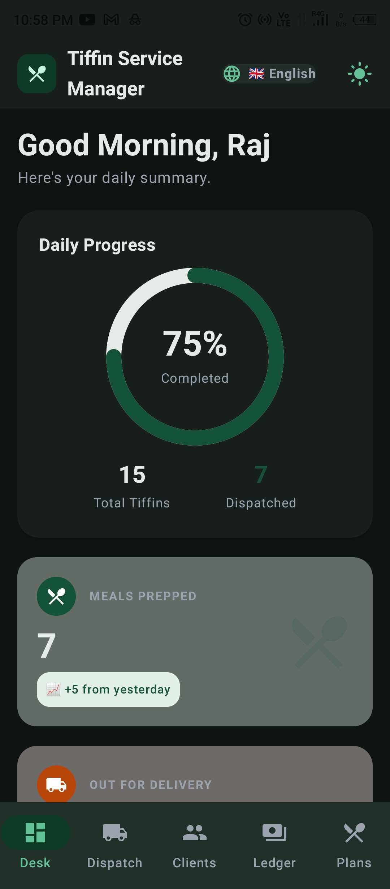
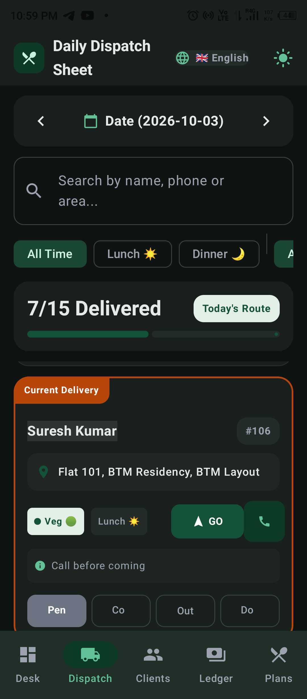
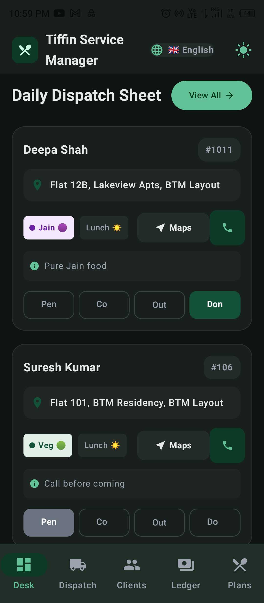
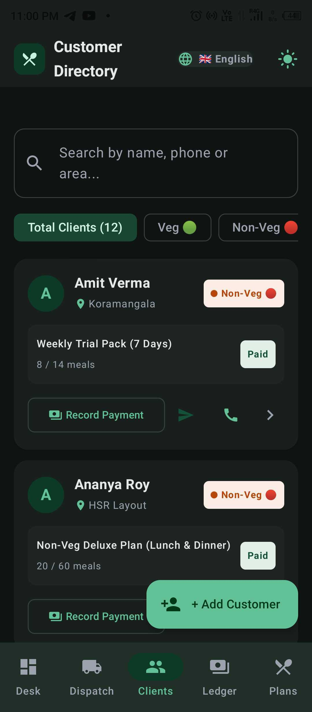
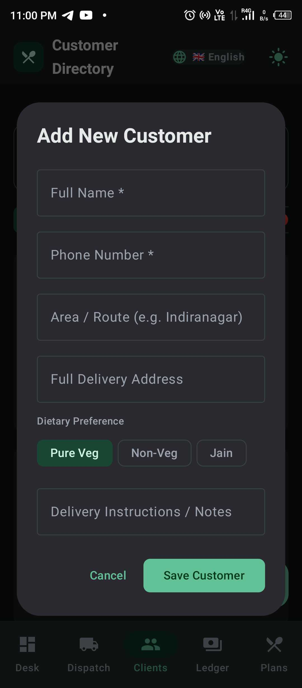
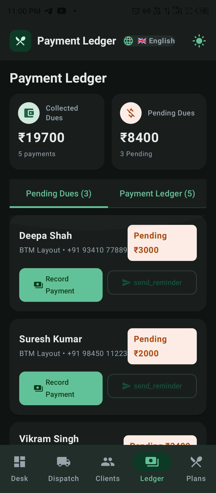
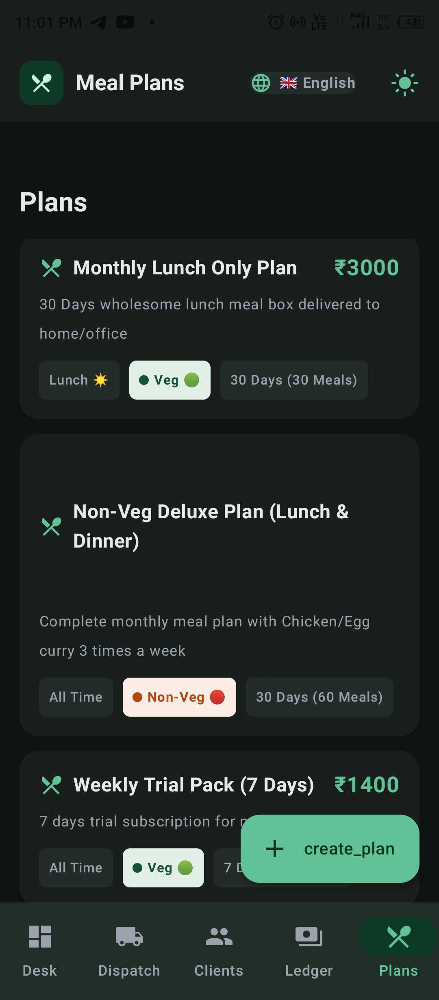
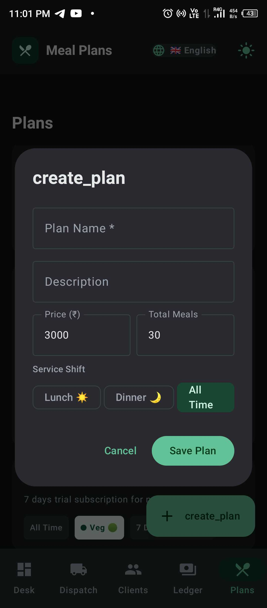

# 🍱 Tiffin CRM – Smart Tiffin Delivery & Subscription Management


**Tiffin CRM** is an offline-first, mobile management suite designed for tiffin services, dabba delivery vendors, mess providers, cloud kitchens, and meal prep businesses. It replaces traditional paper notebooks and fragmented spreadsheets with a streamlined workflow for daily dispatch tracking, recurring meal subscriptions, vacation/pause schedules, customer balances, and WhatsApp communication.

---

## 📸 App Screenshots

The app is a five-tab, fully offline handheld tool: **Desk** (dashboard), **Dispatch**, **Clients**, **Ledger** and **Plans**.

### Flow 1 · Morning Operations

| 📊 Desk — Daily Dashboard | 🛵 Dispatch — Daily Sheet | 🚚 Dispatch — Route Cards |
|:---:|:---:|:---:|
|  |  |  |
| **Ring meter at 75%** with *15 Total Tiffins Dispatched* and a *+5 vs yesterday* delta. | **One sheet per date** (2026-10-03), search by name/phone/area, **Lunch / Dinner** filters and a **7 / 15 Delivered** progress bar. | **Every drop is actionable** — meal count, diet tag (*Pure Jain*, *Call before coming*), then **Maps / Call / WhatsApp / Delivered**. |

### Flow 2 · Customer Directory & Onboarding

| 👥 Clients — Directory | ➕ Clients — Add Customer |
|:---:|:---:|
|  |  |
| **12 clients** grouped by locality (**Koramangala**, **HSR Layout**), filtered by **Veg / Non-Veg**, each row showing plan + meals consumed and a **Record Payment** shortcut. | One screen captures name, phone, area/route, full address, **Pure Veg / Non-Veg / Jain** preference and delivery instructions. |

### Flow 3 · Ledger & Meal Plans

| 💰 Ledger — Payment Ledger | 🍛 Plans — Catalog | 🍛 Plans — Create Plan |
|:---:|:---:|:---:|
|  |  |  |
| **₹19,700 collected** vs **₹8,400 pending**, split into *Payments (5)* and *Pending Dues (3)*, each due row one tap from **Record Payment**. | The plan catalog with price, meal counts and **diet / duration** filters — *Monthly Lunch Only*, *Non-Veg Deluxe*, *Weekly Trial Pack*. | Build a reusable plan once (**price**, **total meals**, **Lunch / Dinner** shift) and assign it to customers instead of retyping. |

> 💡 Prefer reading the app in context? The same five journeys are narrated step by step in [User Flow Explanation](#-user-flow-explanation).

---

## 📑 Table of Contents

- [App Screenshots](#-app-screenshots)
  - [Flow 1 · Morning Operations](#flow-1--morning-operations)
  - [Flow 2 · Customer Directory & Onboarding](#flow-2--customer-directory--onboarding)
  - [Flow 3 · Ledger & Meal Plans](#flow-3--ledger--meal-plans)
- [Project Overview](#-project-overview)
- [Key Features](#-key-features)
- [Architecture & Tech Stack](#-architecture--tech-stack)
- [Database & Data Models](#-database--data-models)
- [Project Directory Structure](#-project-directory-structure)
- [User Flow Explanation](#-user-flow-explanation)
- [Prerequisites & System Requirements](#-prerequisites--system-requirements)
- [Step-by-Step Instructions to Run Locally](#-step-by-step-instructions-to-run-locally)
  - [Method 1: Using Android Studio (Recommended)](#method-1-using-android-studio-recommended)
  - [Method 2: Using Command Line / Terminal](#method-2-using-command-line--terminal)
- [Environment Configuration & Secrets](#-environment-configuration--secrets)
- [Running Automated Tests](#-running-automated-tests)
- [Troubleshooting & FAQs](#-troubleshooting--faqs)

---

## 🌟 Project Overview

Managing a daily tiffin service involves complex logistical coordination:
1. **Daily Route Dispatching:** Knowing who gets lunch vs. dinner, dietary constraints (Pure Veg, Non-Veg, Jain), and specific delivery notes (e.g., "leave on 3rd floor gate").
2. **Customer Pauses & Vacations:** Handling sudden customer calls to pause meals for 2–5 days and resuming without missing a beat.
3. **Flexible Subscriptions:** Managing 30-day or 60-meal prepaid and postpaid plans.
4. **Billing & Ledger:** Tracking overdue balances and generating instant WhatsApp payment reminders.
5. **Language Accessibility:** Catering to kitchen staff and delivery runners with instant multi-language support (English, Hindi, Marathi, Gujarati).

**Tiffin CRM** solves these operational hurdles directly from an Android handheld device without requiring a constant cloud connection.

---

## ⚡ Key Features

### 1. 📊 Operations Dashboard
- **Daily Dispatch Ring Meter:** Visual circular progress showing live deliveries completed vs. pending for today's active route.
- **Dietary Breakdown Counter:** Real-time metrics segmenting meals into **Pure Veg**, **Non-Veg**, and **Jain** to optimize kitchen prep quantities.
- **Financial Summary Cards:** Immediate visibility into today's cash/UPI collections and total outstanding receivables across all customers.
- **Quick Action Triggers:** One-tap navigation to add customers, record payments, and broadcast WhatsApp announcements.

### 2. 🛵 Deliveries & Dispatch Logistics
- **Interactive Date Navigation:** Switch between Today, Yesterday, Tomorrow, or pick any past/future delivery date.
- **Multi-criteria Filtering:** Filter the dispatch roster by:
  - **Meal Time:** All, Lunch, or Dinner.
  - **Delivery Status:** All, Pending, Delivered, or Skipped.
  - **Dietary Preference:** All, Veg, Non-Veg, or Jain.
  - **Search:** Search instantly by customer name, locality, or address.
- **One-Tap Status Toggles:** Mark delivery as *Delivered*, *Skipped*, or revert to *Pending*.
- **Direct Dispatch Actions:**
  - One-tap phone dialer button for direct calling.
  - One-tap WhatsApp button to notify customer regarding delivery arrival.

### 3. 👥 Customer Directory & CRM Profiles
- **Customer List & Search:** Search customers by name, phone number, locality/area, or dietary preference.
- **Customer 360° Profile:**
  - Contact details, full address, delivery instructions, and dietary tag.
  - Active & historical meal subscriptions with meal progress bars (meals consumed vs. total allocated).
  - Complete payment transaction ledger.
  - Upcoming and past delivery pause periods (vacations).
  - Quick action toolbar: **Call**, **WhatsApp**, **Add Subscription**, **Record Payment**, **Add Pause**, and **Edit Profile**.

### 4. ⏸️ Vacation & Pause Scheduling
- Specify start and end dates when a customer is out of town.
- Specify whether the pause applies to Lunch, Dinner, or Both meals.
- Automatic exclusion from the daily delivery dispatch list during active pause periods.

### 5. 🍛 Meal Plans Catalog
- Configurable meal tiers (e.g., Standard Veg Lunch, Deluxe Non-Veg Combo, Jain Pure Thali).
- Defines pricing, duration in days, total meals, and meal timing.

### 6. 💰 Ledger & Payment Management
- Record payments with support for **Cash**, **UPI / GPay / PhonePe**, **Bank Transfer**, and **Card**.
- Track individual customer outstanding balances and payment histories.
- **One-Click WhatsApp Payment Reminder:** Pre-fills a professional payment reminder message with customer name, amount due, and UPI details.

### 7. 🌐 Instant Multi-Language Localization
- Instant app-wide translation supporting 4 Indian regional languages:
  - 🇬🇧 **English**
  - 🇮🇳 **Hindi (हिंदी)**
  - 🚩 **Marathi (मराठी)**
  - 🦁 **Gujarati (ગુજરાતી)**
- Switched seamlessly via the top navigation bar without restarting the app.

### 8. 🌓 Dynamic Dark & Light Theme
- Native Material 3 theming support with high-contrast emerald and slate palettes.
- Persistent one-touch theme switcher in the top bar.

---

## 🛠️ Architecture & Tech Stack

The application strictly follows modern Android Architecture guidelines (**MVVM + Clean Architecture principles**) with an **offline-first local database**.

```
┌────────────────────────────────────────────────────────┐
│             Jetpack Compose UI (View)                  │
│   (Screens, Composables, Material 3, Dynamic Theme)    │
└───────────────────────────▲────────────────────────────┘
                            │ Collects StateFlow
┌───────────────────────────┴────────────────────────────┐
│                    TiffinViewModel                     │
│    (StateFlow, ViewModelScope, Business Logic, UDF)    │
└───────────────────────────▲────────────────────────────┘
                            │ Calls Repository
┌───────────────────────────┴────────────────────────────┐
│                   TiffinRepository                     │
│   (Single Source of Truth, Query Coordination, Seeding)│
└───────────────────────────▲────────────────────────────┘
                            │ Interacts with DAO
┌───────────────────────────┴────────────────────────────┐
│              Room Local Database (SQLite)              │
│       (Customer, Subscription, Delivery, Payment)      │
└────────────────────────────────────────────────────────┘
```

| Category | Technology / Library | Version | Purpose |
| :--- | :--- | :--- | :--- |
| **Language** | Kotlin | `2.2.10` | Modern, null-safe Android development |
| **UI Toolkit** | Jetpack Compose (BOM) | `2024.09.00` | Declarative UI framework |
| **Design System** | Material 3 (M3) | Compose M3 | Dynamic color schemes, components & typography |
| **Local Persistence** | Android Jetpack Room | `2.7.0` | SQLite abstraction for offline storage |
| **Annotation Processing** | KSP (Kotlin Symbol Processing) | `2.3.5` | Fast code generation for Room & Moshi |
| **Asynchronous Logic** | Kotlin Coroutines & Flow | `1.10.2` | Reactive data streaming and background tasks |
| **Lifecycle Integration** | AndroidX Lifecycle | `2.8.7` | `ViewModel`, `collectAsStateWithLifecycle` |
| **Networking & JSON** | Retrofit 2 & Moshi | `2.12.0` | HTTP client & JSON parsing (ready for cloud sync) |
| **Testing** | JUnit 4 & Robolectric | `4.16.1` | Local JVM unit and integration tests |
| **Build System** | Gradle (Kotlin DSL) | `8.x+` (AGP 9.1.1)| Build automation and version catalogs |

---

## 💾 Database & Data Models

The local Room database (`TiffinDatabase`) manages 6 interconnected relational entities:

```
┌─────────────────────┐             ┌─────────────────────────┐
│   CustomerEntity    │ 1 ──────── ∞ │   SubscriptionEntity    │
│  - id (PK)          │             │  - id (PK)              │
│  - name, phone      │             │  - customerId (FK)      │
│  - address, area    │             │  - planId, planName     │
│  - dietaryPreference│             │  - startDate, endDate   │
│  - deliveryNotes    │             │  - totalMeals, price    │
└──────────┬──────────┘             │  - paidAmount, status   │
           │                        └─────────────────────────┘
           │ 1
           ├────────────────────── ∞ ┌─────────────────────────┐
           │                        │  PauseScheduleEntity    │
           │                        │  - id (PK)              │
           │                        │  - customerId (FK)      │
           │                        │  - startDate, endDate   │
           │                        │  - mealTime, reason     │
           │                        └─────────────────────────┘
           │ 1
           ├────────────────────── ∞ ┌─────────────────────────┐
           │                        │  PaymentRecordEntity    │
           │                        │  - id (PK)              │
           │                        │  - customerId (FK)      │
           │                        │  - amount, date         │
           │                        │  - paymentMethod, note  │
           │                        └─────────────────────────┘
           │ 1
           └────────────────────── ∞ ┌─────────────────────────┐
                                    │  DeliveryRecordEntity   │
                                    │  - id (PK)              │
                                    │  - customerId (FK)      │
                                    │  - deliveryDate         │
                                    │  - mealTime, status     │
                                    │  - dietaryType, notes   │
                                    └─────────────────────────┘
```

---

## 📂 Project Directory Structure

```text
├── app/
│   ├── build.gradle.kts                   # App-level build config, plugins, and dependencies
│   ├── proguard-rules.pro                 # ProGuard / R8 rules
│   └── src/
│       ├── main/
│       │   ├── AndroidManifest.xml        # Permissions (Call, Internet) & Activity declaration
│       │   ├── java/com/example/
│       │   │   ├── MainActivity.kt        # Entry point: Scaffold, TopAppBar, Language & Theme
│       │   │   ├── data/
│       │   │   │   ├── SampleData.kt      # Mock seeder for initial run (Customers, Plans, Deliveries)
│       │   │   │   ├── local/             # Room Database layer
│       │   │   │   │   ├── CustomerEntity.kt
│       │   │   │   │   ├── DeliveryRecordEntity.kt
│       │   │   │   │   ├── MealPlanEntity.kt
│       │   │   │   │   ├── PauseScheduleEntity.kt
│       │   │   │   │   ├── PaymentRecordEntity.kt
│       │   │   │   │   ├── SubscriptionEntity.kt
│       │   │   │   │   ├── TiffinDao.kt       # SQL Queries, Insert/Update/Delete operations
│       │   │   │   │   └── TiffinDatabase.kt  # Room Database singleton & migration logic
│       │   │   │   ├── repository/
│       │   │   │   │   └── TiffinRepository.kt# Repository mediating between DAO and UI
│       │   │   │   └── viewmodel/
│       │   │   │       └── TiffinViewModel.kt # State management, business actions, filter flows
│       │   │   └── ui/
│       │   │       ├── components/        # Reusable UI widgets
│       │   │       │   ├── AddEditCustomerDialog.kt
│       │   │       │   ├── AddPauseDialog.kt
│       │   │       │   ├── AddSubscriptionDialog.kt
│       │   │       │   ├── CustomerCard.kt
│       │   │       │   ├── DeliveryItemCard.kt
│       │   │       │   ├── RecordPaymentDialog.kt
│       │   │       │   ├── StatCard.kt
│       │   │       │   └── StatusBadge.kt
│       │   │       ├── screens/           # Main Composable Screen Views
│       │   │       │   ├── CustomerDetailScreen.kt # 360° Customer Profile, Ledger, Subscriptions
│       │   │       │   ├── CustomersScreen.kt      # Directory listing with search and filters
│       │   │       │   ├── DashboardScreen.kt      # Metrics ring, prep breakdown, quick actions
│       │   │       │   ├── DeliveriesScreen.kt     # Dispatch route checklist by date & shift
│       │   │       │   ├── MealPlansScreen.kt      # Catalog of subscription plans
│       │   │       │   └── PaymentsScreen.kt       # Financial transactions and payment tracking
│       │   │       ├── theme/             # Color scheme, typography, shapes
│       │   │       │   ├── Color.kt
│       │   │       │   ├── Theme.kt
│       │   │       │   └── Type.kt
│       │   │       └── util/              # Multi-language localization utilities
│       │   │           ├── AppLanguage.kt
│       │   │           └── Translations.kt
│       │   └── res/                       # App resources (icons, strings, drawables)
│       └── test/                          # Unit and Robolectric JVM test suite
│           └── java/com/example/
│               ├── ExampleRobolectricTest.kt
│               └── ExampleUnitTest.kt
├── gradle/
│   └── libs.versions.toml                 # Version Catalog for centralized dependencies
├── build.gradle.kts                       # Root project Gradle configuration
├── settings.gradle.kts                    # Repository definitions and subproject inclusion
├── metadata.json                          # AI Studio platform identification
└── README.md                              # Complete documentation
```

---

## 🧭 User Flow Explanation

### Flow 1: Morning Kitchen & Dispatch Routine
1. Open the app to the **Dashboard**:
   - The kitchen manager checks the **Dietary Breakdown**:
     - *Example:* "32 Veg, 10 Non-Veg, 3 Jain".
   - The kitchen prepares exact quantities, avoiding food wastage.
2. Navigate to **Deliveries**:
   - Filter by **Lunch** to view only the afternoon route.
   - The delivery executive marks meals as **Delivered** as drop-offs occur.
   - For locked gates or directions, tap the **Phone** or **WhatsApp** icon directly on the card to communicate with the customer.
   - The dashboard progress gauge updates in real time (e.g., "15/45 Delivered").

### Flow 2: Onboarding a New Customer
1. Navigate to **Customers** tab.
2. Tap the **+ Add Customer** Floating Action Button.
3. Fill in details:
   - Full Name, Phone Number, Locality / Area, Delivery Address.
   - Dietary Preference (*Pure Veg*, *Non-Veg*, or *Jain*).
   - Special Delivery Notes (*e.g., "Doorbell broken, call on arrival"*).
4. Save the customer. The customer profile is immediately created in the Room database.
5. Tap the new customer card to open their **Customer 360° Profile**, then tap **+ Add Subscription** to assign a meal plan (e.g., 30-Day Lunch Plan) with start and end dates.

### Flow 3: Handling a Customer Leave / Vacation (Pause Request)
1. Customer calls saying: *"I will be out of station from 12th to 16th October."*
2. Open **Customers** -> Select the customer.
3. In their profile, tap **Pause Service**.
4. Select the start date (`2026-10-12`) and end date (`2026-10-16`), and select whether lunch, dinner, or both are paused.
5. Save. The app automatically ensures no delivery entries are generated for this customer during that date range.

### Flow 4: Collecting Payment & Sending Reminders
1. Navigate to **Payments** tab to see total collected vs. outstanding balance.
2. When a customer pays:
   - Tap **Record Payment**.
   - Enter Amount, choose Payment Method (*Cash*, *UPI / GPay*, *Bank Transfer*), and add an optional note.
   - The customer's balance updates instantly.
3. If an account is overdue:
   - Open customer profile or overdue list -> tap **Send WhatsApp Reminder**.
   - The app prepares a polite reminder message with payment details and opens WhatsApp directly with the customer pre-selected.

### Flow 5: Changing Language or Dark Mode
- Tap the **Language Badge** (`🇬🇧 English`) in the top app bar: choose between **English**, **Hindi (हिंदी)**, **Marathi (मराठी)**, or **Gujarati (ગુજરાતી)**. All UI text updates instantly.
- Tap the **Moon/Sun Icon** in the top right to switch between Dark and Light mode.

---

## 📋 Prerequisites & System Requirements

Before running the project on your local machine, ensure you have the following installed:

1. **Operating System:** macOS (Intel/Apple Silicon), Windows 10/11 (64-bit), or Linux (Ubuntu 20.04+).
2. **Java Development Kit (JDK):** **JDK 17** or **JDK 21** (e.g. OpenJDK, Eclipse Temurin, or the bundled JetBrains Runtime in Android Studio).
3. **Android Studio:** Recommended version: **Android Studio Ladybug (2024.2.1+)**, **Iguana**, or newer.
4. **Android SDK:**
   - **Android SDK Platform:** API Level 34, 35, or 36.
   - **Android SDK Build-Tools:** 34.0.0 or higher.
   - **Android NDK/CMake:** Not required.
5. **Physical Device or Emulator:**
   - An Android device running Android 7.0 (API 24) or higher with **USB Debugging enabled**.
   - OR an Android Virtual Device (AVD) running API 26+ with Google Play services.

---

## 🚀 Step-by-Step Instructions to Run Locally

### Method 1: Using Android Studio (Recommended)

#### Step 1: Clone or Download the Repository
Clone the repository using Git or extract the downloaded ZIP archive into a local folder:
```bash
git clone <repository-url>
cd tiffin-crm
```

#### Step 2: Open Project in Android Studio
1. Launch **Android Studio**.
2. Click **Open** (or **File > Open...**).
3. Navigate to the directory where you extracted/cloned the project and select the root folder (the folder containing `settings.gradle.kts`).
4. Click **OK** to open.

#### Step 3: Configure the JDK
Ensure Android Studio is using **JDK 17 or JDK 21**:
1. Go to **Settings** (or **Preferences** on macOS) `->` **Build, Execution, Deployment** `->` **Build Tools** `->` **Gradle**.
2. Under **Gradle JDK**, select **Embedded JDK** (JBR 17/21) or choose your installed JDK 17/21.
3. Click **Apply** and **OK**.

#### Step 4: Gradle Sync
Android Studio will prompt you to sync Gradle. If not triggered automatically:
- Click **Sync Project with Gradle Files** (the elephant icon with blue arrow in the top right toolbar), or go to **File > Sync Project with Gradle Files**.
- Wait for Gradle to download all dependencies and run KSP code generation.

#### Step 5: Setup an Emulator or Physical Device
- **Using an Emulator:**
  1. Open **Tools > Device Manager**.
  2. Click **Create Virtual Device**.
  3. Select a phone model (e.g., Pixel 7 or Pixel 8) and system image (API 34 or 35 recommended).
  4. Finish the wizard and start the emulator.
- **Using a Physical Device:**
  1. Enable **Developer Options** on your phone (tap *Build Number* 7 times in Settings > About Phone).
  2. Enable **USB Debugging** in Developer Options.
  3. Connect the phone via USB cable and authorize your computer.

#### Step 6: Run the App
1. In the top toolbar, select `app` in the run configurations dropdown.
2. Select your target device (emulator or connected phone).
3. Click the green **Run (▶)** button or press `Shift + F10` (`Control + R` on macOS).
4. The APK will compile, install, and launch the **Tiffin CRM** home screen.

---

### Method 2: Using Command Line / Terminal

You can build, test, and install the application directly from the command line without opening Android Studio.

#### Step 1: Verify Environment Variables
Ensure `ANDROID_HOME` or `ANDROID_SDK_ROOT` is set in your environment:
```bash
# On macOS / Linux (in ~/.bashrc or ~/.zshrc):
export ANDROID_HOME=$HOME/Library/Android/sdk
export PATH=$PATH:$ANDROID_HOME/platform-tools:$ANDROID_HOME/cmdline-tools/latest/bin

# On Windows (PowerShell):
$env:ANDROID_HOME = "$env:LOCALAPPDATA\Android\Sdk"
$env:Path += ";$env:ANDROID_HOME\platform-tools"
```

Verify your Java version:
```bash
java -version
# Should output JDK 17 or JDK 21
```

#### Step 2: Build the Debug APK
Navigate to the project root directory and build:
```bash
# On macOS / Linux:
./gradlew assembleDebug

# On Windows:
gradlew.bat assembleDebug
```
The output APK will be generated at:
```text
app/build/outputs/apk/debug/app-debug.apk
```

#### Step 3: Install APK on a Connected Device / Emulator
Ensure an emulator is running or a device is connected:
```bash
# Check connected devices
adb devices

# Install debug build directly using Gradle
./gradlew installDebug

# Or install manually via ADB:
adb install -r app/build/outputs/apk/debug/app-debug.apk
```

#### Step 4: Launch the Application via ADB
```bash
adb shell am start -n com.aistudio.tiffincrm.kxbvqz/com.example.MainActivity
```

---

## 🔑 Environment Configuration & Secrets

The project uses the **Google Secrets Gradle Plugin** to read runtime properties from a local `.env` file instead of committing sensitive credentials to version control.

1. In the project root, a `.env.example` file is provided:
   ```properties
   # Optional Gemini AI API Key (if enabling AI assistant extensions)
   # GEMINI_API_KEY=your_key_here
   ```
2. To provide custom configuration or API keys, copy `.env.example` to `.env`:
   ```bash
   cp .env.example .env
   ```
3. The app is fully functional offline using local Room DB storage and requires **no external API keys** for its core CRM and delivery features.

---

## 🧪 Running Automated Tests

The project includes local JVM tests using **JUnit 4**, **Robolectric**, and **AndroidX Compose Test Rule** that run quickly without needing a physical device or emulator.

To run all unit and Robolectric tests from the command line:
```bash
# On macOS / Linux:
./gradlew testDebugUnitTest

# On Windows:
gradlew.bat testDebugUnitTest
```

To run a specific test class:
```bash
./gradlew testDebugUnitTest --tests "com.example.ExampleRobolectricTest"
```

Test reports will be generated in HTML format at:
```text
app/build/reports/tests/testDebugUnitTest/index.html
```

---

## ❓ Troubleshooting & FAQs

### 1. `Unsupported class file major version` or Gradle JDK Mismatch
- **Cause:** Your system is using an incompatible JDK version (such as Java 8 or Java 11).
- **Solution:** Set your Gradle JDK in Android Studio to **JDK 17** or **JDK 21** via **Settings > Build, Execution, Deployment > Build Tools > Gradle > Gradle JDK**.

### 2. KSP or Room Schema Generation Errors
- **Cause:** Corrupted build cache or stale incremental symbol processor output.
- **Solution:** Clean the build cache and rebuild:
  ```bash
  ./gradlew --stop
  ./gradlew clean assembleDebug
  ```

### 3. WhatsApp Message Not Opening
- **Cause:** WhatsApp is not installed on the Android Emulator.
- **Solution:** 
  - The app includes an automatic graceful fallback to the Android native SMS composer if WhatsApp is not installed on the device.
  - On a physical phone with WhatsApp installed, it opens the chat directly with the phone number and pre-filled message text.

### 4. Database Pre-population / Resetting Sample Data
- **Behavior:** On first launch, the app seeds realistic sample data (5 customers across multiple localities, active meal plans, today's deliveries, and initial payments) so you can test all screens immediately.
- **How to Reset:** To re-trigger fresh sample data seeding, clear app storage:
  ```bash
  adb shell pm clear com.aistudio.tiffincrm.kxbvqz
  ```

---

## 📄 License & Credits

Built with ❤️ using **Kotlin** & **Jetpack Compose**
